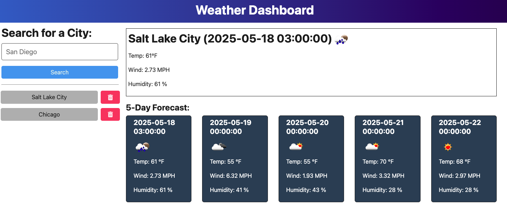

# Weather Dashboard

## Description

The Weather Dashboard is a full-stack application that allows users to search for any city and view current and 5-day weather forecasts. It uses the OpenWeather API to fetch real-time data and saves a searchable history of previous city lookups. The app is built with TypeScript on both the client and server, and is deployed via Render.

---

## Table of Contents

- [Installation](#installation)
- [Usage](#usage)
- [Credits](#credits)
- [License](#license)
- [Deployed Link](#deployed-link)
- [Screenshot](#screenshot)

---

## Installation

To run this app locally:

1. Clone the repository:
   ```bash
   git clone https://github.com/eholt19/Weather-Dashboard.git
   cd Weather-Dashboard/Develop
2. Build the frontend:
    cd client
    npm install
    npm run build
3. Start the backend:
    cd ../server
    npm install
    npm run dev
4. Navigate to http://localhost:3001 in your browser.

--

## Usage

* Enter a city to view current weather and a 5-day forecast.

* Weather data includes temperature (°F), wind speed, humidity, and an icon.

* Previous searches are saved and can be clicked to quickly reload data.

* Users can delete cities from their search history.

--

## Credit

Built by Emily Holt using:

* TypeScript

* Node.js

* Express.js

* OpenWeather API

* Vite

--

## License

This project is licenced under the MIT License.

--

## Deployed Link

https://weather-dashboard-m4xd.onrender.com

--

## Screenshot


